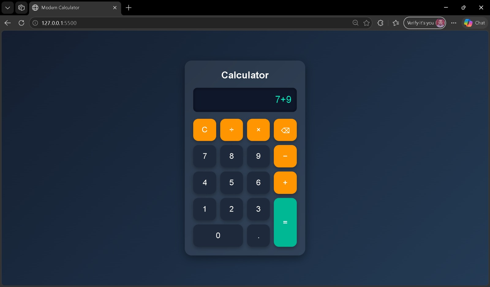
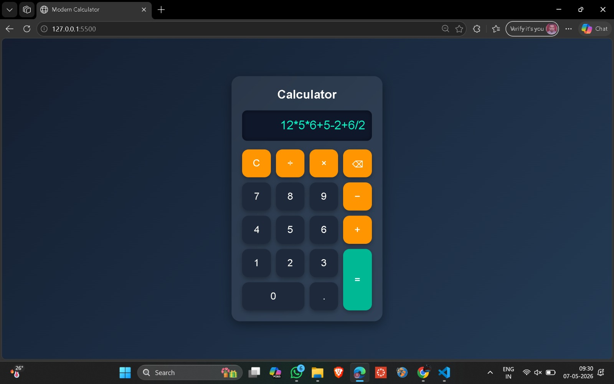
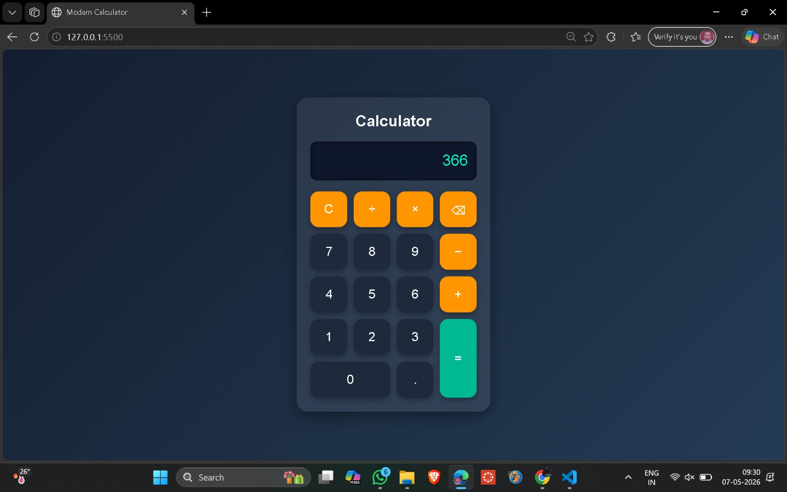

# Modern Calculator

A modern and responsive calculator built using HTML, CSS, and JavaScript.

## Features

* Beautiful Glassmorphism UI
* Responsive Design
* Basic Arithmetic Operations
* Error Handling
* Hover Animations
* Clean and Modern Layout

## Technologies Used

* HTML5
* CSS3
* JavaScript

## Project Structure

```bash
modern-calculator/
│
├── index.html
├── style.css
└── script.js
```

## Live Demo

🔗 https://sunil-705.github.io/modern-calculator/

## Screenshots

### Screenshot 1



### Screenshot 2


### Screenshot 3



### Screenshot 4



## How to Run

1. Download or clone the repository
2. Open `index.html`
3. Start using the calculator

## Author

**Sunil Kumar**
